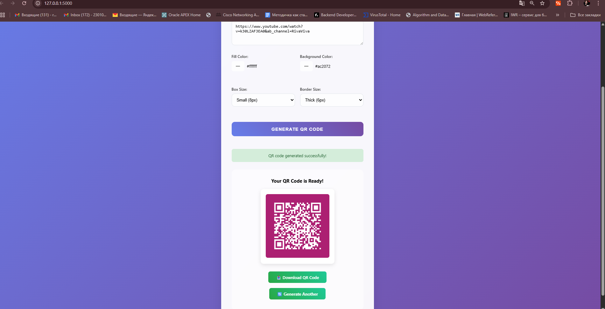

# 🎯 QRCraft - Modern QR Code Generator

A sleek and user-friendly QR code generator built with Flask and modern web technologies. Create customizable QR codes with different colors, sizes, and styles instantly.


## ✨ Features

- Generate QR codes from any text or URL
- Customize QR code colors (fill and background)
- Adjust QR code size and border
- Real-time preview
- One-click download
- Responsive design
- CLI mode support
- RESTful API endpoint

## 🚀 Getting Started

### Prerequisites

- Python 3.11 or higher
- pip (Python package manager)

### Installation

1. Clone the repository:

```sh
git clone https://github.com/yourusername/qrcraft.git
cd qrcraft
```

2. Create a virtual environment and activate it:

```sh
python -m venv .venv
# On Windows
.venv\Scripts\activate
# On macOS/Linux
source .venv/bin/activate
```

3. Install dependencies:

```sh
pip install -r requirements.txt
```

### Running the Application

#### Web Interface

```sh
python app.py
```

Open your browser and navigate to `http://127.0.0.1:5000`

#### CLI Mode

```sh
python app.py --cli
```

## 🔧 API Usage

### Generate QR Code via REST API

```sh
curl -X POST http://127.0.0.1:5000/api/generate \
  -H "Content-Type: application/json" \
  -d '{
    "data": "https://example.com",
    "fill_color": "black",
    "back_color": "white",
    "box_size": 10,
    "border": 4
  }'
```

## 📸 Screenshots



## 🛠️ Built With

- [Flask](https://flask.palletsprojects.com/) - Web framework
- [qrcode](https://pypi.org/project/qrcode/) - QR code generation
- [Pillow](https://python-pillow.org/) - Image processing
- HTML5/CSS3 - Frontend
- JavaScript - Client-side interactions

## 📝 License

This project is licensed under the MIT License - see the [LICENSE](LICENSE) file for details.
